# SeatLoom PRD v0.2

| 项目 | 内容 |
| --- | --- |
| 产品 | SeatLoom |
| 文档 | PRD v0.2 |
| 状态 | **Archived — superseded by PRD v0.3** |
| 更新时间 | 2026-04-24 |
| 文档语言 | 中文 |

## 1. 产品定义

SeatLoom 是一套面向 AI 编程团队的本地优先协作控制平面。

它不替代 Codex、Claude Code、Gemini CLI、GitHub Copilot、Cursor CLI 等底层 Agent 工具，也不试图变成另一个 IDE、另一个 swarm 框架，或者另一个云上 agent 平台。SeatLoom 覆盖在这些工具之上，把原本散落在多个终端窗口、多个日志目录、多个 session 和记忆碎片中的工作，组织成一个持续存在、可追踪、可切换、可治理、可复利增长的多席位团队系统。

一句话定位：

> SeatLoom 让多角色、多工具、多会话的 AI 项目协作，从“人工复制粘贴 + 多窗口盯盘”，升级为“本地优先、可审计、可恢复、可治理的协作操作面”。

其中：

- `Seat` 是稳定协作身份，例如 Lyra、Nimbus、Flux，或者人类负责人。
- `Session` 是某个 Seat 在某个工具中的连续工作上下文，也就是“这个工具里的脑子”。
- `WorkItem` 是项目推进的工作单元。
- `Artifact` 是值得长期保存和复用的材料。
- `Handoff` 是一次正式责任交接。
- `Pipeline` 是自动化编排与流程化执行能力。
- `SeatLoom` 负责维护跨工具、跨阶段、跨人的项目级连续性，包括留痕、上下文重建、标准约束、交接、评估、自动化、记忆与技能沉淀。

SeatLoom 的核心承诺：

1. 用显式 `Handoff`、结构化对象和自动化流程，替代人工复制粘贴式编排。
2. 用项目级 `Ledger` 和本地数据目录，替代散落在各工具中的隐式日志与不可复用的标准输出。
3. 保留工具原生 `Session` 的连续性，同时支持跨工具、跨 runtime 的上下文重建。
4. 让 `Seat`、`Pipeline`、项目知识、规范和工作经验可以随项目推进持续复利。
5. 通过工程化的规则、关口和策略，降低 LLM 的随意性，而不是仅靠 prompt 约束。

## 2. 背景与问题陈述

今天的高阶用户已经可以手动搭建一个小型 AI 团队：

- 在多个 terminal / iTerm2 窗口中同时运行 Codex、Claude Code、Gemini CLI、GitHub Copilot、Cursor CLI 等工具。
- 为每个窗口赋予角色，例如 Product Owner、CTO、Engineer、QA、Reviewer。
- 在窗口之间手动传递上下文、需求、测试结果和反馈，推动项目向前。

这个模式在“能跑起来”层面已经成立，但一旦项目复杂度上升，就会暴露系统性瓶颈。

### 2.1 当前协作模式的真实瓶颈

最大瓶颈不是单个模型能力，而是你自己成为了调度总线：

- 你负责在窗口之间复制、翻译、筛选、压缩和转发上下文。
- 你负责判断哪个角色应该收到什么，什么时候需要补充什么。
- 你负责追踪哪些任务已经完成，哪些被卡住，哪些输出值得长期保留。
- 你负责在工具崩溃、切换、失忆或跑偏时手动恢复连续性。

于是：

- 协作带来了表面上的并行，但实质上吞吐仍被人工 routing 限制。
- 输出散落在 stdout、工具日志、聊天历史、diff、测试报告和脑内记忆里。
- 项目历史不可回放，责任链不可审计，经验难以沉淀。
- 多工具协作变成了一种高强度人工流水线，而不是产品化系统。

### 2.2 仅靠工具原生日志为什么不够

虽然各工具通常都能保留部分 session 历史、session id 或 resume 能力，但这些能力并不能解决项目级问题：

- 原生日志大多是工具私有格式，难以跨工具统一检索和关联。
- 日志只记录“发生了什么”，但不自动形成项目级对象关系。
- 当某个 Seat 从工具 A 切换到工具 B 时，原生 session 无法天然迁移。
- 同样一条输出里，既有即时噪声，也有长期价值内容，缺少结构化提升机制。
- 缺少正式交接、签收、审批、退回、评估与规范约束。

### 2.3 SeatLoom 要解决的根本问题

SeatLoom 不是在做“更多 agent”，而是在解决下面这些更难的问题：

- 一个真实项目里，多个 Seat 如何长期存在，而不是仅在某个窗口里暂时活着。
- 一个 Seat 的连续性如何在保留原工具脑状态的同时，跨工具延续。
- 一个项目中的内容、责任、状态、证据、经验如何被系统性保存和串联。
- 自动化与人机协作如何共存，并始终能回答“为什么做了这一步”。
- 如何通过工程方法让 LLM 在团队中更稳定地工作。

## 3. 目标用户与典型场景

### 3.1 目标用户

1. `AI-native 独立开发者 / Founder`
   - 一个人同时操盘多个 AI coding agent，希望获得接近“小团队”的吞吐。
2. `高级工程师 / 技术负责人`
   - 已经在使用多个 coding 工具，希望把角色分工、测试、评审和规范流程固化下来。
3. `小型 AI 编程团队`
   - 团队成员与 AI agent 混编，要求项目留痕、审计、恢复和质量治理。
4. `实验型团队 / Agentops 用户`
   - 希望试验不同 Seat、不同模型、不同流程模板，并评估效果与成本。

### 3.2 典型高价值场景

- 四席位研发：Lyra 负责需求、Nimbus 负责架构与实现、Flux 负责测试、你负责决策与批准。
- 跨工具迁移：某个 Seat 在 Claude Code 起草方案，在 Codex 实现，在 Cursor CLI 做局部修复。
- 夜间自治：你睡前给出目标，SeatLoom 自动分发、执行、验证、汇总，第二天只留下 review / approve 工作。
- 审计回放：几天后追踪某次错误变更，能还原是谁、在哪个 session、依据哪些上下文、经过什么 gate 做出的。
- 经验复用：某类修复、某类 handoff 模板、某类测试约束反复出现，系统能沉淀为模板、技能或规范包。

### 3.3 最终用户实际会拿到什么

对最终用户来说，SeatLoom 不是一篇理念文档，而是一整套可直接上手的本地产品组合：

- 一个项目内的 `.seatloom/` 数据目录，用来保存 Seat、Session、WorkItem、Artifact、Handoff、Pipeline、Ledger 与恢复材料。
- 一个 `seatloom` CLI，用来初始化项目、注册 Seat、附着或启动 Session、创建交接、查看时间线、触发 Pipeline。
- 一个常驻 `daemon`，负责监听队列、处理触发器、执行自动化、夜间推进任务，并在重启后从 Ledger 恢复状态。
- 一个 `TUI / Dashboard`，集中呈现 Seat 状态、Inbox、Timeline、Review Queue、Risk、Cost，而不是靠你来回切换终端窗口盯盘。
- 一组运行时适配器，用来接入 Codex、Claude Code、Gemini CLI、GitHub Copilot CLI、Cursor CLI，以及 Shell / CI。
- 一套 `PolicyPack + Instruction Stack + Pipeline` 模板，让团队规范、交接格式、验证流程和审批节点可以复用。

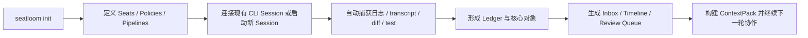

## 4. 产品目标与非目标

### 4.1 产品目标

SeatLoom v1 的目标：

- 让每个协作角色拥有稳定 `Seat`，不再被单一工具绑定。
- 同时保住工具内连续上下文和项目级持久上下文。
- 把交接从模糊聊天片段升级为显式、结构化的 `Handoff`。
- 把自动化与 `Pipeline` 建成一等公民，并要求完整留痕。
- 让项目中所有关键输入、输出、责任、状态、证据都可追踪。
- 为未来的 skill growth、memory growth、quality evaluation 留出产品骨架。

### 4.2 非目标

SeatLoom 第一阶段不是：

- 不是另一个 coding agent IDE。
- 不是另一个只负责拉起 CLI 进程的 runtime orchestrator。
- 不是一个以“100+ agent swarm 自主进化”为第一卖点的框架。
- 不是一个必须依赖云端才能工作的 SaaS 平台。
- 不是一个自动合并一切代码、完全去掉人类审批的系统。

## 5. 设计原则

- `本地优先`：项目数据默认随项目落地，可检查、可迁移、可回放。
- `保住原生脑状态`：SeatLoom 不压扁工具原生 session，而是把它当一等对象。
- `显式优于隐式`：能显式沉淀的上下文，不应只困在隐藏聊天历史里。
- `项目语义优先于执行细节`：先解决项目里的对象、责任和连续性，再谈更深的自动化与智能优化。
- `策略优先于提示词`：规范、关口、约束和状态校验应尽量工程化，而非完全依赖 prompt。
- `人类保留最终裁决`：重要交接、风险变更、review 与 merge 应具备明确的人类接管点。
- `渐进自治`：允许从纯手动编排，逐步升级为 assisted、daemon、overnight，而不是一次跳到全自动。
- `工具无关`：SeatLoom 协调异构 Agent Runtime，而不是押注单一工具。

## 6. 产品边界与分层

SeatLoom 要站在正确的层级上。

- 它不直接等于 IDE。
- 它不直接等于进程编排器。
- 它不直接等于 swarm 学习引擎。
- 它是项目级协作控制平面。

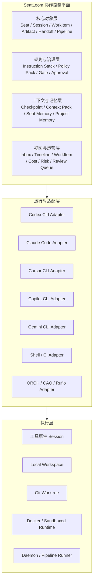

### 6.1 与外部参照的边界

- `ORCH`：更像多 agent 团队运行时。
- `CLI Agent Orchestrator`：更像多 CLI agent 的编排运行时与控制台。
- `Ruflo`：更像 swarm 执行、路由、学习与持久记忆引擎。
- `JetBrains Air`：更像 IDE 内的 task cockpit 与 agentic workspace。
- `Hyperagent`：更像组织级 agent deployment 与治理平台。

SeatLoom 的差异化：

- 以 `Seat` 为稳定身份，而不是仅以 agent process 为中心。
- 以 `Session` 为工具脑状态，而不是压平成统一 run。
- 以 `WorkItem + Artifact + Handoff + Ledger` 为项目语义骨架。
- 以 `Context Pack + Policy + Views` 为跨工具协作与治理基础。

### 6.2 SeatLoom 的最小系统组成

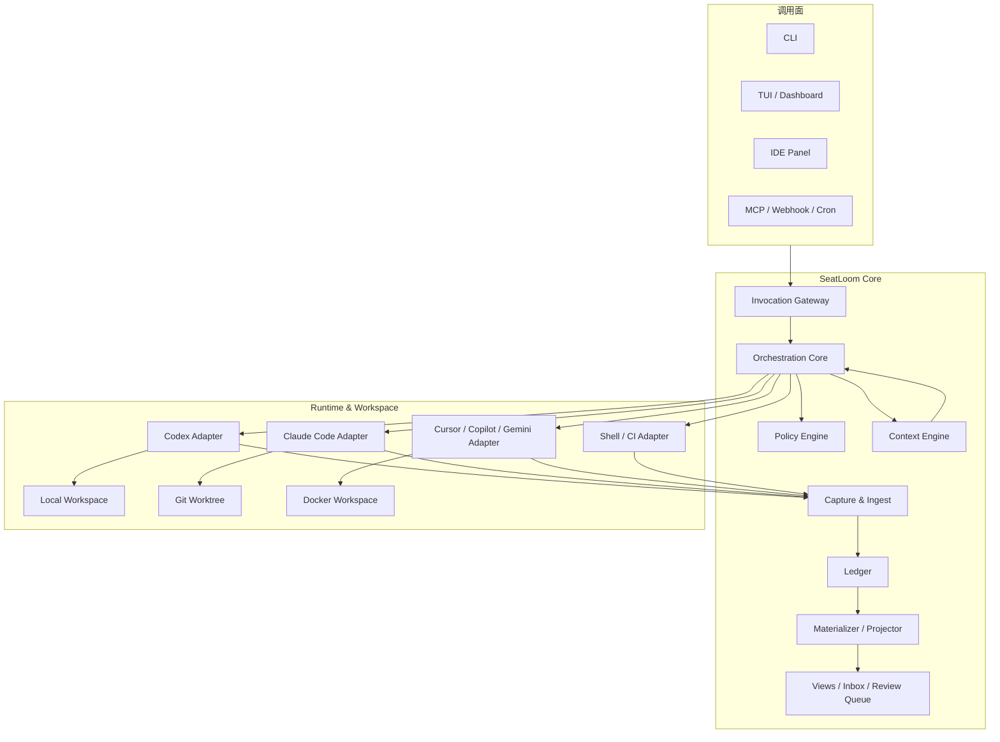

最小实现建议拆成 7 个核心能力：

- `Invocation Gateway`：统一接住 human / seat / automation / external 的动作请求。
- `Orchestration Core`：负责对象变更、队列推进、Session 生命周期、Handoff 路由。
- `Policy Engine`：执行 schema 校验、状态 gate、权限、预算、审批要求。
- `Context Engine`：从 Session、Artifact、Ledger、Memory 构建 `LaunchPack` 与 `ContextPack`。
- `Capture & Ingest`：采集 stdout、stderr、transcript、tool call、diff、test report、webhook。
- `Ledger + Materializer`：把原始事实写入 append-only 账本，再投影为对象与视图。
- `Views Layer`：把底层对象和事件聚合为 Inbox、Timeline、Seat View、Risk View、Review Queue。

## 7. 核心对象模型

SeatLoom 顶层对象保持少而稳；复杂度放到字段、关系与 supporting entities 中。

### 7.1 顶层对象

| 对象 | 含义 | 为什么是一等对象 |
| --- | --- | --- |
| `Seat` | 稳定协作身份 | 保住角色连续性，不被工具切换打断 |
| `Session` | 某个工具中的连续工作上下文 | 保住 Codex、Claude Code、Cursor CLI 等工具内的脑状态 |
| `WorkItem` | 有目标、有边界、有完成标准的工作单元 | 把项目推进主线固定下来 |
| `Artifact` | 值得长期保存和复用的材料 | 避免顶层概念无限膨胀 |
| `Handoff` | 一次正式责任交接 | 替代模糊回复链和聊天片段 |
| `Pipeline` | 可复用的多阶段自动化定义 | 编排跨阶段、跨 Seat 的流程逻辑 |

### 7.2 Supporting Entities

以下对象存在，但不提升为顶层概念：

| Supporting Entity | 作用 |
| --- | --- |
| `Run` | 记录某次 Session 执行片段或 Pipeline 执行实例 |
| `Checkpoint` | 从 Session 中提取的可恢复快照 |
| `ContextPack` | 给新 Session 或新阶段注入的显式上下文包 |
| `SeatProfile` | Seat 的 runtime 配置、权限、默认工具、预算等 |
| `PolicyPack` | 规则、关口、约束和模板集合 |
| `Evaluation` | 对某次输出、Artifact、WorkItem 或 Seat 表现的评分与结论 |
| `MemoryCandidate` | 待审核的可长期沉淀记忆条目 |
| `SkillCandidate` | 待审核的可长期沉淀技能 / SOP / 模板 |
| `Receipt` | Handoff 的接收、签收、退回、完成记录 |

### 7.3 对象关系图

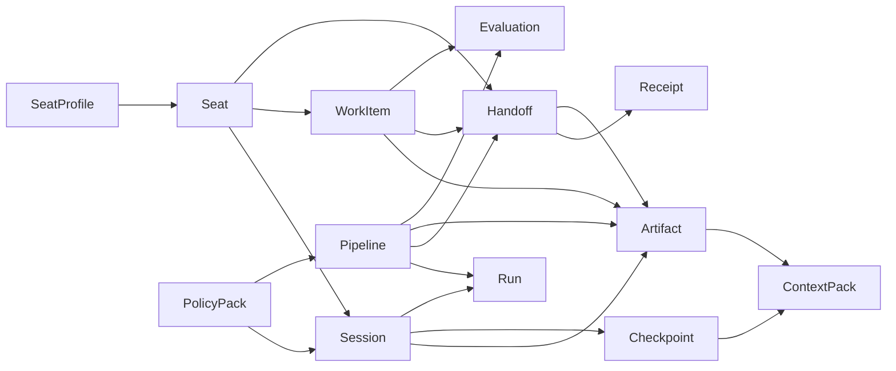

### 7.4 最小 schema 建议

#### `Seat`

| 字段 | 说明 |
| --- | --- |
| `seat_id` | 稳定主键 |
| `name` | 显示名 |
| `role` | 角色定位，如 PO / CTO / QA |
| `runtime_profile_ref` | 默认运行配置 |
| `seat_memory_ref` | 角色长期记忆引用 |
| `status` | active / paused / archived |

#### `Session`

| 字段 | 说明 |
| --- | --- |
| `session_id` | 稳定主键 |
| `seat_id` | 所属 Seat |
| `runtime` | 本次承载 runtime，如 codex / claude_code / cursor_cli |
| `provider` | 模型提供方或工具提供方 |
| `native_session_id` | 底层工具自己的 session 标识 |
| `workspace_binding` | 绑定的 local / worktree / docker 信息 |
| `branch` | 分支名 |
| `status` | launching / running / input_required / suspended / completed / failed |
| `launch_pack_ref` | 启动时使用的 ContextPack |
| `last_checkpoint_ref` | 最近可恢复快照 |

#### `WorkItem`

| 字段 | 说明 |
| --- | --- |
| `workitem_id` | 稳定主键 |
| `title` | 标题 |
| `goal` | 目标描述 |
| `owner_seat_id` | 当前 owner |
| `status` | draft / ready / active / blocked / in_review / verified / done / reopened |
| `acceptance_criteria` | 完成标准 |
| `depends_on` | 依赖 WorkItem 列表 |
| `parent_id` | 父任务 |
| `priority` | 优先级 |
| `risk_level` | 风险等级 |

#### `Artifact`

| 字段 | 说明 |
| --- | --- |
| `artifact_id` | 稳定主键 |
| `kind` | 材料类型 |
| `title` | 标题 |
| `source_ref` | 来源 Session / Pipeline / Event |
| `storage_uri` | 实际内容位置 |
| `checksum` | 校验值 |
| `summary` | 摘要 |
| `sensitivity` | 权限 / 敏感级别 |

#### `Handoff`

| 字段 | 说明 |
| --- | --- |
| `handoff_id` | 稳定主键 |
| `from_ref` | 发起者 |
| `to_ref` | 接收者 |
| `target_ref` | 关联 WorkItem / Session / Pipeline |
| `purpose` | 交接目的 |
| `expected_outcome` | 期望结果 |
| `artifact_refs` | 附件材料 |
| `required_receipt` | 是否需要签收 |
| `status` | drafted / sent / received / accepted / returned / completed / expired |

#### `Pipeline`

| 字段 | 说明 |
| --- | --- |
| `pipeline_id` | 稳定主键 |
| `name` | 名称 |
| `trigger` | 触发条件 |
| `inputs` | 输入对象与查询规则 |
| `stages` | 阶段定义 |
| `gates` | 校验与关口 |
| `outputs` | 产物定义 |
| `retry_policy` | 重试策略 |

### 7.5 `Artifact.kind` 建议

为控制复杂度，多数长期有价值的内容收敛到 `Artifact`，通过 `kind` 区分：

- `brief`
- `acceptance_criteria`
- `design_note`
- `implementation_plan`
- `diff_summary`
- `test_report`
- `bug_report`
- `review_note`
- `release_note`
- `decision_record`
- `context_pack`
- `checkpoint_summary`
- `runbook`
- `skill_note`
- `memory_note`

## 8. 内容分类、持久化与可追踪性

SeatLoom 必须区分“捕获到了什么”和“系统如何理解、提升与复用这些东西”。

### 8.1 内容来源矩阵

| 来源路径 | 典型内容 | 原始层保存 | 结构化提升 | 关联对象 |
| --- | --- | --- | --- | --- |
| CLI stdout | 普通输出、总结、错误 | `raw/stdout.log` | 事件、Artifact、Evaluation | Session / Run |
| CLI stderr | 错误、告警 | `raw/stderr.log` | 异常事件 | Session / Run |
| Transcript | 用户输入、Agent 回复、工具调用摘要 | `raw/transcript.jsonl` | Handoff、Artifact、Checkpoint | Session |
| 文件变更 | diff、patch、commit、branch | `raw/diff.patch` | Artifact、Evaluation | Session / WorkItem |
| 测试结果 | 测试报告、覆盖率、失败栈 | `raw/test/` | Artifact(`test_report`) | WorkItem / Pipeline |
| 外部事件 | GitHub webhook、CI、定时器、文件监听 | `raw/events/` | Ledger Event、Pipeline Run | Pipeline |
| 人工输入 | 需求、审批、纠偏、review | `raw/human/` | WorkItem、Handoff、Decision Record | WorkItem / Handoff |
| 自动化输出 | 汇总、队列、报告、通知 | `raw/pipeline/` | Artifact、Evaluation、Receipt | Pipeline |

### 8.2 五层数据体系

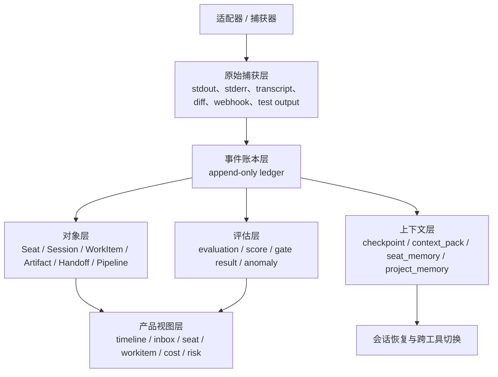

### 8.3 为什么要追加写 Ledger

SeatLoom 需要一个 append-only 的事件账本，因为：

- 原始输出不一定稳定，但事件序列是追踪和回放的基础。
- 结构化对象可能随着规则迭代而重建，但账本要尽量保持事实层。
- 账本能把人工触发、自动触发、外部触发和 Seat 动作统一到一条时间线上。

Ledger 至少记录：

- `who`：谁触发了动作
- `why`：为什么触发
- `when`：绝对时间
- `where`：哪个 Seat / Session / Pipeline / WorkItem
- `what`：发生了什么事件
- `evidence`：原始证据位置
- `result`：状态变化或输出引用

### 8.4 Canonical Event 模型

为了让回放、审计、重建视图和跨版本迁移成立，SeatLoom 需要一层稳定的 Canonical Event。

| 字段 | 说明 |
| --- | --- |
| `event_id` | 稳定事件主键 |
| `event_type` | 事件类型，如 `session.started`、`handoff.sent` |
| `occurred_at` | 事件发生时间 |
| `actor_ref` | 触发者引用 |
| `object_refs` | 关联对象列表 |
| `causation_ref` | 由哪个上游事件或命令导致 |
| `correlation_id` | 同一链路或同一事务的关联标识 |
| `evidence_refs` | 原始日志、transcript、diff、report 的引用 |
| `payload_ref` | 结构化详情位置 |
| `schema_version` | 事件 schema 版本 |

建议首批事件族：

- `invocation.*`：人类、Seat、自动化、外部事件触发。
- `session.*`：started / resumed / input_required / suspended / completed / failed。
- `artifact.*`：created / promoted / superseded / archived。
- `handoff.*`：drafted / sent / received / accepted / returned / completed。
- `pipeline.*`：triggered / stage_started / stage_completed / gate_blocked / failed / completed。
- `evaluation.*`：generated / accepted / rejected。
- `memory.*`：candidate_created / accepted / rejected / retired。

### 8.5 证据链与对象提升链

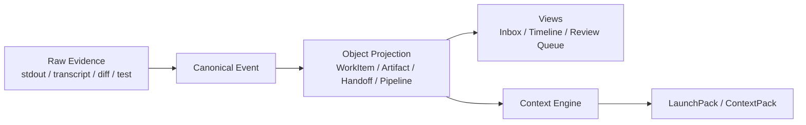

这条链路的意义是：

- `Raw Evidence` 保证事实可回查。
- `Canonical Event` 保证回放和重建有稳定语义。
- `Object Projection` 保证产品能围绕项目对象而不是原始噪声工作。
- `LaunchPack / ContextPack` 保证历史能继续服务下一轮协作，而不是只躺在日志里。

## 9. 本地存储结构

SeatLoom 必须把本地落盘结构写清楚，这是可恢复、可迁移、可审计的基础。

建议项目根目录下使用 `.seatloom/`：

```text
.seatloom/
  config/
    project.yaml
    seats.yaml
    adapters.yaml
  ledger/
    events.jsonl
    indexes/
  seats/
    lyra/
      profile.yaml
      memory/
        accepted.jsonl
        candidates.jsonl
    nimbus/
      profile.yaml
    flux/
      profile.yaml
  sessions/
    ses_01/
      meta.yaml
      raw/
        stdout.log
        stderr.log
        transcript.jsonl
        tool_calls.jsonl
      checkpoints/
        cp_01.yaml
      context/
        launch_pack.md
      outputs/
        diff.patch
        notes.md
    ses_02/
      ...
  workitems/
    wi_001.yaml
    wi_002.yaml
  artifacts/
    ar_001/
      meta.yaml
      payload.md
    ar_002/
      meta.yaml
      payload.json
  handoffs/
    ho_001.yaml
    ho_001.receipts.jsonl
  pipelines/
    definitions/
      requirement_handoff.yaml
      verification_loop.yaml
    runs/
      plrun_001/
        meta.yaml
        logs.jsonl
        outputs/
  evaluations/
    ev_001.yaml
  policies/
    org/
    project/
    seat/
  templates/
    teams/
    handoffs/
    context_packs/
  views/
    inbox.json
    timeline.json
    risks.json
```

### 9.1 存储原则

- 原始层尽量保真，不轻易覆盖。
- 结构化层可随着版本升级进行重建或迁移。
- 大文件、二进制文件和测试输出按引用存储，不全部内联进 YAML。
- 所有结构化对象尽量带 `created_at`、`updated_at`、`source_event_ids`、`source_refs`。

### 9.2 三类数据生命周期

| 层级 | 特征 | 生命周期策略 |
| --- | --- | --- |
| `raw` | 原始捕获，尽量保真 | 默认不可变，只允许追加或归档 |
| `canonical` | Ledger 与标准化事件 | append-only，可迁移 schema，不回写历史事实 |
| `derived` | 视图、索引、聚合、缓存 | 可随版本重建，不作为唯一事实来源 |

### 9.3 索引与恢复原则

SeatLoom 的恢复能力不应依赖某个进程内存，而要依赖本地目录与 Ledger 重建：

- 启动时先重放 `ledger/events.jsonl`，再重建 Inbox、Timeline、Risk、Review Queue。
- `Session` 的恢复优先使用 `native_session_id`，若底层工具不可恢复，则退回 `Checkpoint + ContextPack`。
- `WorkItem`、`Handoff`、`Artifact` 的当前态由对象文件与最新事件共同确定。
- 所有派生视图都必须可以删除后重新 materialize。

建议至少建立以下索引：

- 按 `seat_id`
- 按 `session_id` / `native_session_id`
- 按 `workitem_id`
- 按 `handoff_id`
- 按 `pipeline_id` / `pipeline_run_id`
- 按时间窗口与 `event_type`
- 按 `branch` / `workspace_binding` / `artifact.kind`

## 10. 发起者、调用入口与触发面

SeatLoom 里的动作发起者不只有人和 Seat。

### 10.1 Trigger Actor 模型

| actor_kind | 含义 | 示例 |
| --- | --- | --- |
| `human` | 人类用户 | 你、团队成员 |
| `seat` | 稳定协作身份 | Lyra、Nimbus、Flux |
| `automation` | SeatLoom 内置自动化 | Pipeline、守护进程、定时器 |
| `external` | SeatLoom 外部事件源 | GitHub、CI、Webhook、文件系统 |

如果这些触发者不被显式建模，后续将无法真正回答“是谁、因为什么、在什么时候推动了哪一步”。

### 10.2 调用入口

| 入口 | 主要用途 |
| --- | --- |
| `CLI` | 本地命令行控制、查询、触发、resume |
| `TUI / Dashboard` | 多 Seat 观察、收件箱、时间线、风险视图 |
| `IDE Panel` | 在开发工作台中观察任务、切换、review、恢复 |
| `MCP` | 供外部 agent 或工具调用 SeatLoom |
| `Webhook / Git Event` | GitHub、CI、Issue、PR、push 等触发 |
| `Cron / Daemon` | 周期性任务、夜间任务、巡检、汇总 |
| `Filesystem Watcher` | 文件变化、测试结果、构建状态触发 |

### 10.3 触发流图

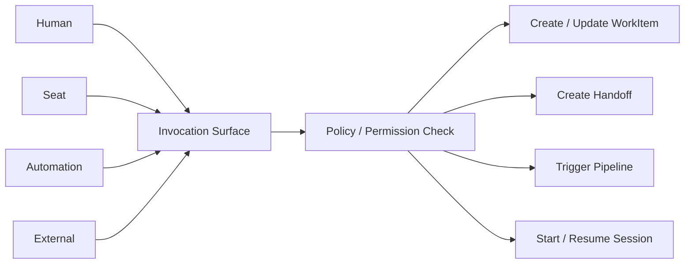

## 11. Seat、Session 与运行时模型

### 11.1 `Seat` 不是一个窗口，而是稳定协作身份

一个 Seat 可以：

- 绑定多个工具
- 持有多个 session 历史
- 带着自己的 profile、记忆、技能、预算和权限
- 在不同 runtime 之间切换，但保持角色连续性

### 11.2 `SeatProfile` 要素

`SeatProfile` 让 Seat 从“角色名”升级为“可运行、可治理的协作成员”。

| 字段 | 说明 |
| --- | --- |
| `preferred_runtimes` | 默认工具偏好，如 claude_code -> codex |
| `allowed_runtimes` | 允许使用的 runtime 范围 |
| `default_model` | 默认模型 |
| `tool_permissions` | 可用工具与限制 |
| `budget_policy` | token / cost / duration 上限 |
| `workspace_policy` | local / worktree / docker 偏好 |
| `instruction_refs` | 默认规范引用 |
| `pipeline_permissions` | 允许触发的 pipeline |
| `approval_requirements` | 哪些动作需要人工批准 |

### 11.3 `Session` 承载“工具里的脑子”

关键原则：

- `Session` 负责保住一个工具里的脑状态。
- SeatLoom 不假设工具隐藏记忆可以无损迁移。
- SeatLoom 通过 `Checkpoint + Artifact + Ledger + Instruction Stack + WorkItem State` 重建跨工具上下文。

### 11.4 运行环境模型

参考多任务工作区实践，SeatLoom 需要支持至少三种 workspace binding：

- `local_workspace`
- `git_worktree`
- `docker_workspace`

| 模式 | 优势 | 风险 |
| --- | --- | --- |
| `local_workspace` | 启动最快，复用当前环境 | 任务互相干扰风险高 |
| `git_worktree` | 代码隔离好，适合并行实现 | 依赖与环境仍跑在本机 |
| `docker_workspace` | 环境隔离强，适合高风险任务 | 启动成本更高 |

### 11.5 Session 启动包

SeatLoom 启动或恢复一个 Session 时，不能只给一句 prompt，而应组装一个 `Session Launch Pack`，至少包含：

- 当前 `WorkItem` 摘要与目标
- 最近相关 `Artifact`
- 最近 `Handoff`
- 上一个可用 `Checkpoint`
- 必须遵循的 `Instruction Stack`
- 关联工作区、分支、权限、预算、工具限制
- 为什么创建该 Session 的原因说明

### 11.6 跨工具切换图

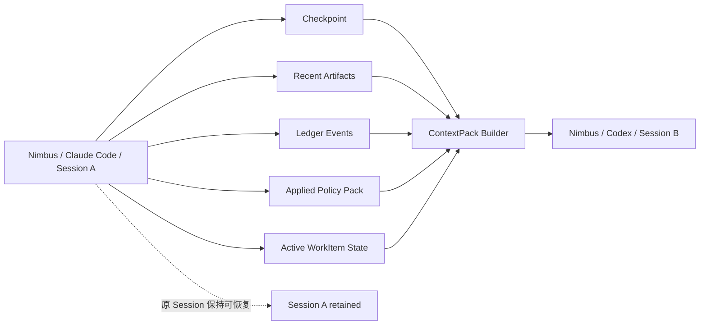

### 11.7 适配层三档接入策略

为了尽快落地，同时兼容不同工具能力，建议把适配层设计成三档：

| 接入档位 | 方式 | 适用工具 | 优势 | 局限 |
| --- | --- | --- | --- | --- |
| `wrapper_capture` | 由 SeatLoom 包装启动命令并捕获 IO | 大多数 CLI | 最快落地、统一性高 | 对工具内部语义感知有限 |
| `native_attach` | 读取原生 session id、日志目录、resume 能力 | Codex / Claude Code / Cursor CLI 等 | 保留工具原生连续性更好 | 依赖各工具暴露能力 |
| `managed_launcher` | SeatLoom 直接负责启动、隔离、停止和恢复 | Shell / CI / 自有适配器 | 生命周期控制最强 | 对接入要求最高 |

MVP 建议优先：

1. 先做 `wrapper_capture + native_attach` 的组合。
2. 对关键工具保留 `native_session_id` 与原生日志位置。
3. 把 `managed_launcher` 先用于 Shell / CI / Pipeline 阶段。

### 11.8 `Seat`、`Session`、`Run` 的映射

为了避免概念混乱，建议保持下面的解释边界：

- `Seat`：长期存在的协作身份。
- `Session`：某个 Seat 在某个 runtime 中的一段连续脑状态。
- `Run`：Session 内的一次执行片段，或者 Pipeline 的一次执行实例。
- `Checkpoint`：从 Session 中抽出的可恢复摘要。

因此：

- 不要把 `Run` 升格为顶层对象去取代 `Session`。
- 也不要把所有执行都压缩到 `Session`，否则难以表达重试、失败和阶段执行。
- `Run` 负责回答“这次执行发生了什么”，`Session` 负责回答“这个工具脑子如何连续存在”。

## 12. WorkItem 图谱与状态机

### 12.1 为什么是图谱而不是平面列表

真实项目中，工作不会线性展开。SeatLoom 需要允许：

- 父子拆分
- 依赖阻塞
- 重新打开
- 所有权切换
- review / verify / fix 回环

### 12.2 WorkItem 关系

- `parent_of`
- `child_of`
- `depends_on`
- `blocked_by`
- `related_to`
- `reopened_from`
- `spawned_by`

### 12.3 WorkItem 生命周期

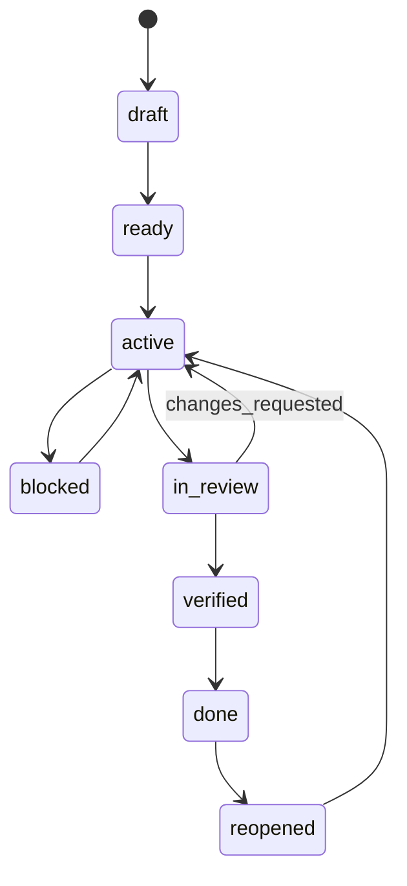

### 12.4 Session / Run 生命周期

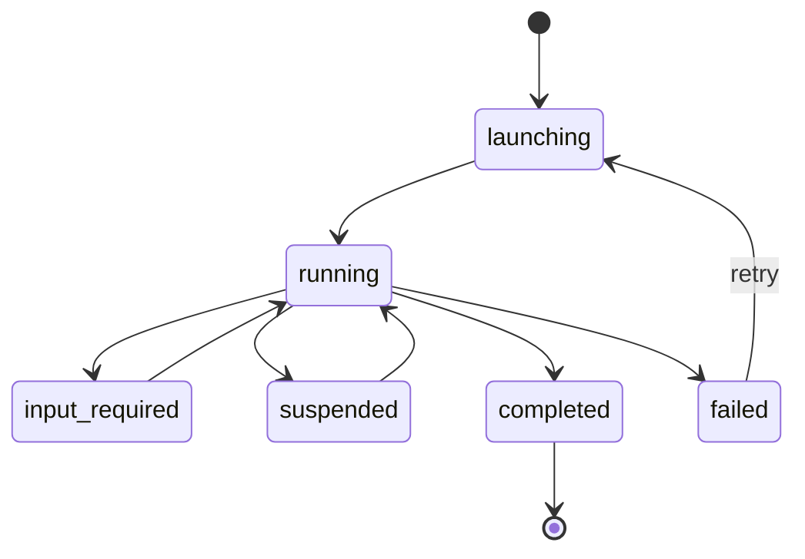

### 12.5 Handoff 生命周期

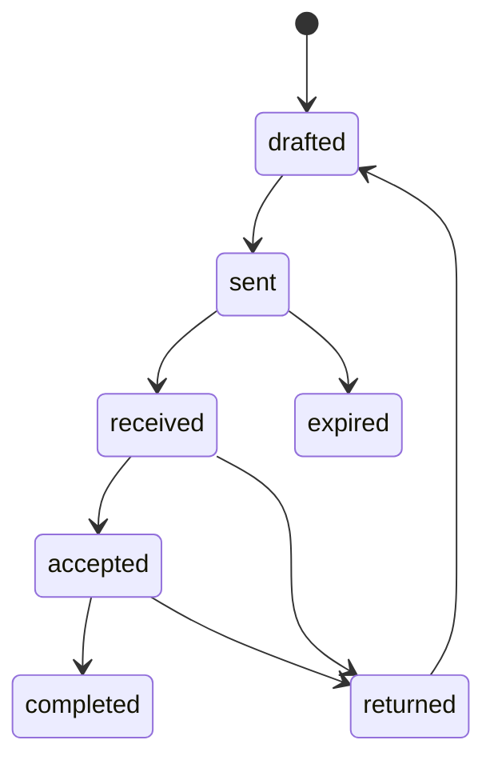

## 13. 协作通道：message、broadcast、handoff

不是所有沟通都应该被建模成正式 Handoff。

### 13.1 三层协作通道

| 通道 | 定位 | 是否顶层对象 |
| --- | --- | --- |
| `message` | 轻量澄清、催办、补充说明、QA 反馈 | 否，作为 ledger event + inbox item |
| `broadcast` | 面向一组 Seat 的通知或同步 | 否，作为 ledger event + inbox item |
| `handoff` | 正式责任交接，要求目标、预期结果和材料 | 是 |

### 13.2 为什么需要这三层

- 全部用 message 会导致责任模糊。
- 全部用 handoff 会导致操作过重。
- `broadcast` 能承载“全员同步但不转移责任”的场景。

### 13.3 Handoff 最小必填字段

- `from_ref`
- `to_ref`
- `target_ref`
- `purpose`
- `expected_outcome`
- `artifact_refs`
- `due_hint`（可选）
- `required_receipt`

### 13.4 Receipt 机制

用户此前提出的“sign / 签收”需求，应体现在 `Receipt` 而不是另造顶层对象：

- `received`
- `accepted`
- `returned`
- `completed`
- `expired`

这样可以明确：

- 交接是否真正被看到
- 是否确认接手
- 是否因信息不足被退回
- 是否已完成交付

## 14. Instruction Stack 与规范继承

SeatLoom 必须通过工程化方式约束 LLM 行为。

### 14.1 规范继承栈

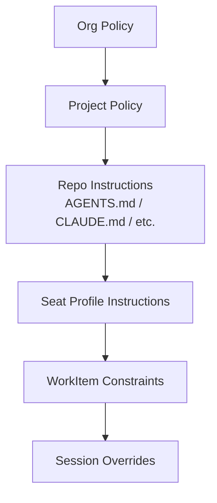

### 14.2 解释

- `Org Policy`：组织级通用规则。
- `Project Policy`：项目自己的规范、审批要求、质量标准。
- `Repo Instructions`：仓库内已有指令文件，例如 `AGENTS.md`、`CLAUDE.md`、`.mcp.json` 等。
- `Seat Profile Instructions`：某类 Seat 的工作方式、语气、职责边界。
- `WorkItem Constraints`：针对当前任务的特殊要求。
- `Session Overrides`：仅本次 session 生效的临时说明。

### 14.3 规则不应只存在于 prompt

SeatLoom 需要把以下内容工程化：

- 角色约束
- 工具权限
- 输入必填项
- 状态流转校验
- review / verify gate
- 预算与时间限制
- 升级 / 退回 / 重试条件

### 14.4 Policy Pack

`PolicyPack` 可以包含：

- `coding_standard`
- `testing_standard`
- `handoff_template`
- `review_gate`
- `release_gate`
- `security_gate`
- `escalation_rule`

## 15. Pipeline 与守护进程模式

### 15.1 `Pipeline` 为什么是一等对象

除了人和 Seat 发起的动作，还有大量自动化场景：

- 需求整理后自动创建 handoff
- 实现完成后自动触发验证
- 测试失败后自动创建返工交接
- 夜间定时汇总各 Seat 进展
- 仓库发生变化时自动触发某个检查流

如果 Pipeline 不是一等对象，就无法完整记录：

- 为什么启动
- 读了哪些输入
- 跑了哪些阶段
- 被什么 gate 卡住
- 产出了什么

### 15.2 Pipeline 执行流

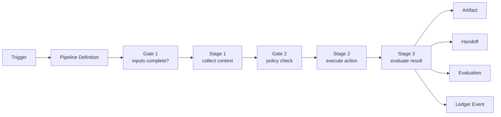

### 15.3 运行模式

| 模式 | 说明 |
| --- | --- |
| `interactive` | 以人工操作为主，SeatLoom 只做记录与辅助 |
| `assisted` | SeatLoom 自动触发部分 handoff / pipeline |
| `daemon` | 常驻运行，监听队列和触发器 |
| `ci` | 只处理当前任务并退出 |
| `overnight` | 夜间自主推进，次日形成汇总 |

### 15.4 首批内置 Pipeline 建议

- `requirement_handoff`
- `implementation_kickoff`
- `verification_loop`
- `review_request`
- `nightly_digest`
- `stalled_workitem_scan`

### 15.5 Pipeline DSL 最小定义

为了保证 Pipeline 可配置、可审计、可恢复，建议最小 DSL 至少包含：

- `trigger`：谁触发、何时触发、触发条件是什么。
- `selectors`：选哪些 WorkItem / Artifact / Seat / Session 作为输入。
- `stages`：每个阶段做什么，由谁执行，使用什么 workspace / runtime。
- `gates`：哪些前置条件、审批、校验必须通过。
- `outputs`：预期产物和产物归属。
- `retry`：失败后是否重试、如何退避。
- `idempotency`：避免同一触发被重复执行。
- `timeouts`：阶段超时和整体超时。

```yaml
id: verification_loop
trigger:
  kind: artifact.created
  selector:
    artifact_kind: diff_summary
stages:
  - id: collect_context
    action: build_context_pack
  - id: run_verifier
    seat: flux
    runtime: codex
    workspace: git_worktree
    action: launch_session
  - id: evaluate
    action: summarize_test_results
gates:
  - id: acceptance_exists
    when: before.run_verifier
    rule: workitem.acceptance_criteria_present == true
outputs:
  - kind: test_report
  - kind: evaluation
  - kind: handoff
retry:
  max_attempts: 2
  backoff: exponential
idempotency:
  key: "{{workitem_id}}:verification_loop:{{artifact_id}}"
```

### 15.6 失败恢复、锁与幂等

自动化如果没有失败恢复设计，就很难在真实项目里长期运行。SeatLoom 需要：

- `Project Lock`：同一项目同一时刻只允许一个 daemon 拥有主调度权。
- `Stage Snapshot`：每个 Pipeline Stage 完成后记录快照，允许从安全点恢复。
- `Idempotency Key`：对 webhook、文件监听、重放等重复触发去重。
- `Retry Policy`：区分可重试错误与不可重试错误。
- `Human Takeover`：到达重试上限后转为 `input_required` 或进入 Inbox。
- `Compensation`：如果某阶段已落地产物但后续失败，系统要能标记 superseded / abandoned，而不是静默覆盖。

## 16. 记忆、技能与学习闭环

SeatLoom 必须支持成长，但第一阶段不应过度神化“自动进化”。

### 16.1 记忆分层

| 类型 | 说明 |
| --- | --- |
| `seat_memory` | 某个 Seat 的长期偏好、工作习惯、常见策略 |
| `project_memory` | 项目特有约定、决策、领域知识 |
| `session_memory` | 某个 Session 的短期工作记忆 |
| `skill_note` | 被总结出的可复用 SOP、模板、技巧 |

### 16.2 升格流程

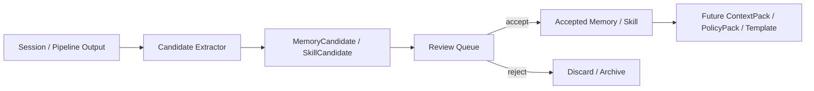

### 16.3 第一阶段设计原则

- 候选经验先进入 review queue。
- 人工审核与策略审核都可以批准或驳回。
- 被接受的内容进入长期资产。
- 被长期证明无效的技能和记忆可以退休。

## 17. 视图体系

SeatLoom 不应逼用户翻原始日志，而要提供少量高价值视图。

| 视图 | 要回答的问题 |
| --- | --- |
| `Seat View` | 这个 Seat 现在在干什么，在哪些 Session 里？ |
| `Session View` | 每个工具 Session 保留了哪些连续上下文？ |
| `WorkItem View` | 这件工作现在卡在哪、依赖谁、接下来由谁推进？ |
| `Inbox View` | 哪些消息、交接、审批、输入请求正在等待处理？ |
| `Timeline View` | 项目从开始到现在发生了什么？ |
| `Review Queue` | 哪些输出需要 review / approve / merge？ |
| `Cost View` | 哪些 Seat、Session、Pipeline 花费最高？ |
| `Risk View` | 哪些 pipeline 失败了、漂移了、缺证据？ |
| `Memory Queue` | 哪些经验候选待确认？ |

## 18. 质量、成本与评估体系

系统记录一切，不等于系统知道什么是好。

### 18.1 Evaluation 模型

SeatLoom 需要支持对以下对象进行评估：

- `Artifact`
- `WorkItem`
- `Handoff`
- `Session`
- `Pipeline`
- `Seat`

### 18.2 可评估维度

- 完整性
- 正确性
- 可执行性
- 证据充分性
- 与 acceptance criteria 的匹配度
- token 成本
- 时间成本
- 返工率
- 被退回率

### 18.3 Rubric 示例

- `需求质量 rubric`
- `实现交付 rubric`
- `测试报告 rubric`
- `handoff 质量 rubric`
- `夜间自治汇总 rubric`

## 19. 状态机、视图与产品交互定义

为了避免概念歧义，PRD 中明确这两个词：

### 19.1 什么是“状态机”

状态机是产品层定义的允许状态与合法流转规则，用来回答：

- 当前对象处于什么阶段
- 能转移到哪些下一状态
- 哪些前置条件必须满足
- 哪些非法变更必须被拒绝

在 SeatLoom 中，至少有三类状态机：

- `WorkItem` 状态机
- `Session / Run` 状态机
- `Handoff / Receipt` 状态机

### 19.2 什么是“视图”

视图是面向用户的高价值观察切面，不是新的底层对象。它们来自：

- 对象层聚合
- 账本层回放
- 评估层筛选
- 上下文层引用

例如：

- `Inbox View` 不是新对象，而是待处理 message、handoff、receipt、input_required 事件的聚合。
- `Risk View` 不是新对象，而是失败 pipeline、低分 evaluation、超时 session 的聚合。

## 20. 标准化与反随意性机制

SeatLoom 需要在产品级减少 LLM 的随意性。

### 20.1 五类约束

1. `结构约束`
   - Handoff、Artifact、Evaluation 使用 schema 校验。
2. `流程约束`
   - 未达到 gate 不能推进状态。
3. `权限约束`
   - 不同 Seat / runtime 拥有不同工具能力。
4. `预算约束`
   - token、时长、重试次数、并发数受限。
5. `审批约束`
   - 高风险操作需要人工确认。

### 20.2 关键 gate 示例

- 没有 acceptance criteria 不能进入实现阶段。
- 没有关联证据的测试结论不能标记为 verified。
- 没有目标对象和期望结果的 handoff 不能发送。
- 未经 review 的代码不能进入 done / merge-ready。
- 超预算 session 自动降级、暂停或请求人工接管。

### 20.3 强制标准的工程化落点

| 约束目标 | 工程化落点 | 对应对象 / 模块 |
| --- | --- | --- |
| 需求必须可验收 | `WorkItem.acceptance_criteria` 必填 + 状态 gate | WorkItem / Policy Engine |
| 交接必须说清目标与期望结果 | `Handoff` schema 校验 | Handoff / Policy Engine |
| 代码必须经 review 才能进入 done | `review_request` Pipeline + Approval | Pipeline / Receipt / Evaluation |
| 测试结论必须有证据 | `Artifact(test_report)` + evidence_refs | Artifact / Ledger |
| 不同 Seat 不能乱用高风险工具 | `SeatProfile.tool_permissions` | SeatProfile / Runtime Adapter |
| Session 超预算自动收敛 | budget guard + `input_required` | Session / Policy Engine |
| 自动沉淀经验必须先审核 | candidate -> review queue -> accept | Memory / Skill Growth |

标准一旦要长期执行，就不应该只写在 prompt 里，而应该落到 schema、gate、审批、权限、预算和目录结构上。

## 21. MVP 范围

### 21.1 MVP 必须实现

- 支持项目内定义命名 `Seat`
- 支持以下工具族的 `Session` 注册与关联：
  - Codex
  - Claude Code
  - Gemini CLI
  - GitHub Copilot CLI
  - Cursor CLI
- 把 `WorkItem`、`Artifact`、`Handoff`、`Pipeline` 作为核心对象
- 支持 append-only `Ledger`
- 支持 `Checkpoint + ContextPack` 进行跨工具上下文重建
- 支持 `message / broadcast / handoff` 三层通道
- 支持至少三种 workspace policy：local / worktree / docker（docker 可先为预留设计）
- 支持至少两个内置 Pipeline：
  - `requirement_handoff`
  - `verification_loop`
- 支持最小版 `Instruction Stack`
- 支持最小版 `PolicyPack` 与状态 gate
- 支持至少五个高价值视图：Seat / Session / WorkItem / Inbox / Timeline

### 21.2 P1

- 守护进程模式
- 风险与成本视图
- 经验候选与审批队列
- Team / Seat 模板
- ORCH / CAO 适配层

### 21.3 P2

- 更强的 memory / skill growth
- 更强的评估体系与 A/B 对比
- 组织级调用入口
- 更强的 swarm / routing 集成
- 更强的远程执行与部署能力

## 22. MVP 验收标准

### 22.1 连续性

- 系统必须允许在项目内定义持久 `Seat`。
- 系统必须支持一个 `Seat` 绑定多个跨工具 `Session`。
- 系统必须把工具原生 `Session` 当作一等对象，而不是压扁成一次泛化执行记录。
- 系统必须支持基于 `Checkpoint + ContextPack` 创建新 `Session`。

### 22.2 可追踪性

- 系统必须把关键输入输出保存到原始层。
- 系统必须把 `Artifact`、`Handoff`、`Pipeline Run` 与源 `Session`、源事件关联起来。
- 系统必须支持按 WorkItem 回放完整链路。

### 22.3 正式交接

- 系统必须支持结构化 `Handoff` 创建和持久化。
- 系统必须允许 `Handoff` 关联多个 `Artifact`、目标对象、交接目的和期望结果。
- 系统必须支持 `Receipt` 的接收、退回、完成流程。
- 系统必须在关键状态变更前校验 `Handoff` 必填字段。

### 22.4 自动化

- 系统必须支持基于 trigger 的 `Pipeline`。
- 系统必须记录 Pipeline 为什么启动、读取了哪些输入、执行了哪些阶段、产出了什么输出。

### 22.5 约束

- 系统必须支持最小版 `Instruction Stack`。
- 系统必须支持至少 3 条状态 gate。
- 系统必须支持最小版 runtime / tool permission 配置。

### 22.6 可靠性与恢复

- 系统重启后，必须可以仅基于 `.seatloom/` 与 `ledger/events.jsonl` 重建主要视图。
- 如果底层工具的原生 Session 无法 resume，系统必须可以退化到 `Checkpoint + ContextPack` 恢复。
- 原始日志、Canonical Event 与派生视图的关系必须可追溯，不能出现“对象存在但没有证据来源”。
- Pipeline 失败后，系统必须能说明失败阶段、失败原因、已产出对象与下一步接管建议。

### 22.7 可移植性与本地优先

- 用户复制整个项目目录后，SeatLoom 的核心项目状态必须可以随项目迁移。
- 结构化对象与原始材料应优先使用文本格式和相对路径引用。
- 系统在离线状态下仍应支持核心记录、回放、恢复与本地 Pipeline。

## 23. 典型场景

### 23.1 四席位功能开发

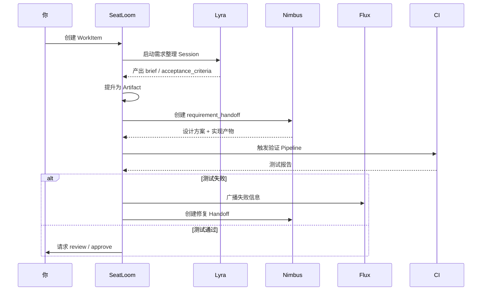

### 23.2 Seat 从工具 A 切到工具 B

1. Nimbus 在 Claude Code 的 Session A 中完成设计。
2. SeatLoom 从 Session A 提取 checkpoint、最近 Artifact、关联账本事件、当前 WorkItem 状态与适用规范。
3. SeatLoom 生成 `ContextPack`。
4. Codex 中启动 Session B，并注入新的 launch pack。
5. Session A 仍保留，可被 resume。
6. SeatLoom 在时间线中把 A -> B 的连续性明确记录下来。

### 23.3 夜间自治

1. 你在晚上创建一个目标并配置 `overnight` 模式。
2. SeatLoom 根据模板创建多个 WorkItem 与初始 Handoff。
3. 守护进程轮询队列、触发 Session、收集结果、跑验证、记录失败。
4. 次日早上系统只给你：
   - 待 review 项
   - 失败项与原因
   - 花费与产出概览
   - 建议接受的技能 / 记忆候选

## 24. 指标体系

### 24.1 价值指标

- 单个 `WorkItem` 上人工跨窗口复制粘贴耗时
- Seat 从一个工具迁移到另一个工具所需时间
- 具备完整追踪链路的 WorkItem 占比
- 因缺少上下文被退回的 Handoff 比例
- 夜间自治后次日人工只需处理的事项占比

### 24.2 运营指标

- Pipeline 成功率 / 失败率
- Session 恢复成功率
- Input required 平均响应时间
- Handoff 接收与完成时长
- 平均 token 成本 / WorkItem
- 返工率 / reopen 率

### 24.3 质量指标

- review 退回率
- verification 失败率
- Artifact 完整性评分
- Handoff 质量评分
- 规范违规次数

## 25. 风险与开放问题

### 25.1 主要风险

- 各工具内部隐藏上下文可能永远无法被完整导出。
- 如果 Handoff 结构过重，用户可能觉得操作成本过高。
- `Artifact` 提升策略很难拿捏，提太多会很吵，提太少会丢价值。
- 多工具适配层容易被上游 CLI 变化影响。
- 本地优先虽利于隐私与掌控，但也要求更细的目录和权限治理。
- 如果前期对象和字段设计过多，系统会失去可理解性。

### 25.2 当前开放问题

- `ContextPack` 的默认裁剪策略如何设计，才能兼顾完整性与上下文成本？
- `PolicyPack` 采用 YAML DSL 还是声明式 JSON schema？
- `Artifact` 与 `Evaluation` 的自动生成阈值如何定义？
- 首批适配器是深集成各工具，还是先以 transcript / shell 代理方式统一接入？
- 守护进程是否需要内建简单调度器，还是优先复用外部调度器？

## 26. 与外部项目的借鉴关系

### 26.1 借鉴但不复制

| 参照项目 | 借鉴点 | SeatLoom 不应复制的部分 |
| --- | --- | --- |
| `ORCH` | worktree 隔离、状态机、守护进程、任务运行操作面 | 不把自己变成纯 runtime orchestrator |
| `CLI Agent Orchestrator` | agent profile、provider 抽象、tool restrictions、browser inbox | 不只做 session 管理与消息收发 |
| `Ruflo` | memory、skill growth、claims / ownership、学习闭环 | 不在 v1 先追求大规模 swarm |
| `JetBrains Air` | task cockpit、input required、suspended / resume、execution environment | 不变成 IDE 产品 |
| `Hyperagent` | 组织级调用入口、评估、成本、agent fleet 视角 | 不在第一阶段就变成云上部署平台 |
| `Multica` | agent as teammates、board/workspace 心智、CLI + daemon 配对、自托管体验 | 不让 SeatLoom 退化成 issue board 或 hosted managed-agent 平台 |
| `LangGraph / AutoGen / CrewAI` | durable execution、graph/flow 编排、interrupt、guardrails、agent abstraction | 不要求用户先写框架代码才能使用 SeatLoom |

### 26.2 SeatLoom 的边界结论

- `ORCH` 解决“怎么编排多个 agent 跑起来”。
- `CLI Agent Orchestrator` 解决“怎么调起、管理和观察多个 CLI agent”。
- `Ruflo` 解决“怎么让一群 agent 更会协作与学习”。
- `JetBrains Air` 解决“开发者工作台里如何同时跑多个 agent task”。
- `Hyperagent` 解决“组织级 agent 如何部署、治理、衡量与扩散”。
- `Multica` 更接近“把 agent 当同事去分派和跟踪”的产品形态。
- `LangGraph / AutoGen / CrewAI` 更接近“编写 agent workflow 的开发框架”。
- `SeatLoom` 解决“一个真实项目里，多角色、多工具、多会话的协作过程，如何持续存在、可追踪、可迁移、可复利”。

## 27. 下一步落地建议

1. 明确 `Seat`、`Session`、`WorkItem`、`Artifact`、`Handoff`、`Pipeline` 的最小 schema。
2. 先实现 `.seatloom/ledger/events.jsonl` 与核心对象目录结构。
3. 把前两个 Pipeline 写细：`requirement_handoff` 与 `verification_loop`。
4. 明确 `ContextPack Builder` 的输入、裁剪、输出格式。
5. 落第一版 `Instruction Stack` 与 3 条最小 gate。
6. 做最小版视图：Inbox、WorkItem、Session、Timeline、Review Queue。
7. 再决定是优先做 ORCH/CAO 适配，还是优先做原生 CLI transcript 适配。

---

## 附录 A：v0.2 的一句话判断

SeatLoom 不是“更多 agent”，而是“把多 agent、多工具、多会话协作真正产品化”的控制平面。

## 附录 B：最小 CLI / TUI 命令面建议

```bash
seatloom init
seatloom seat add lyra --role product_owner
seatloom seat add nimbus --role cto
seatloom seat add flux --role qa

seatloom session attach --seat lyra --runtime claude_code --native-session-id cc_xxx
seatloom session launch --seat nimbus --runtime codex --workitem WI-12
seatloom session resume --session SES-03

seatloom workitem create --title "实现 OAuth 登录"
seatloom handoff create --from lyra --to nimbus --workitem WI-12
seatloom pipeline run verification_loop --workitem WI-12

seatloom inbox
seatloom timeline --workitem WI-12
seatloom review-queue
seatloom daemon start
```

这组命令面的目标不是一次做全，而是保证 SeatLoom 从第一天起就有清晰、可演进的用户操作骨架。

## 附录 C：适配器最小契约建议

每个 runtime adapter 建议声明自己的能力矩阵：

| 能力 | 说明 |
| --- | --- |
| `can_launch` | 能否由 SeatLoom 启动新 Session |
| `can_attach` | 能否附着到现有原生 Session |
| `can_resume` | 能否使用原生 session id 恢复 |
| `can_capture_transcript` | 能否拿到结构化对话 transcript |
| `can_capture_tool_calls` | 能否拿到工具调用摘要 |
| `can_inject_input` | 能否程序化发送输入 |
| `can_stop` | 能否优雅停止 |
| `workspace_modes` | 支持 local / worktree / docker 中哪些模式 |

适配器的统一输出至少应包含：

- `native_session_id`
- `runtime`
- `stdout` / `stderr` 引用
- `transcript` 引用（若可得）
- `tool_call` 引用（若可得）
- `workspace_binding`
- `exit_status`
- `timing`

## 附录 D：推荐的实现顺序

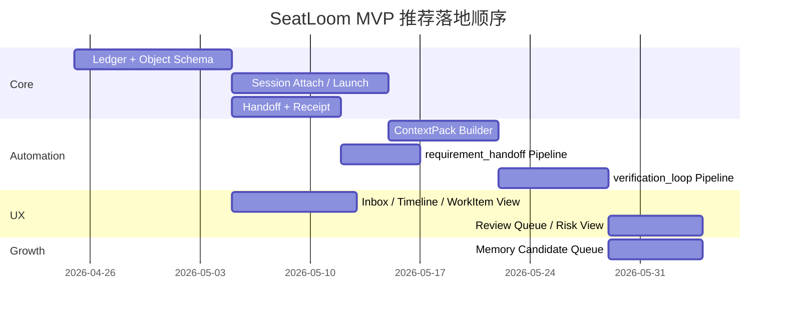
