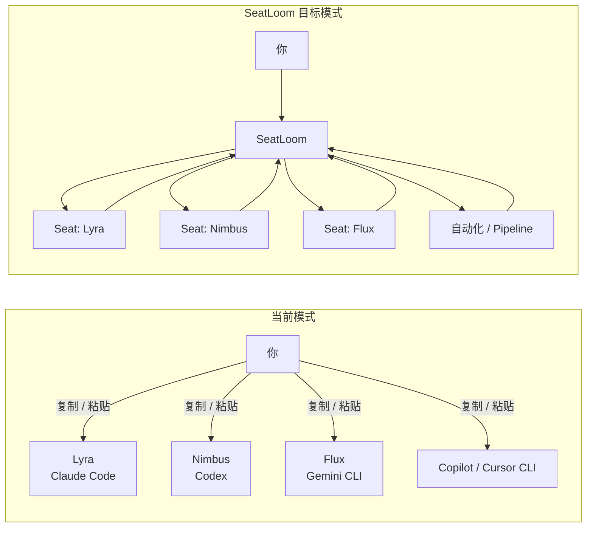
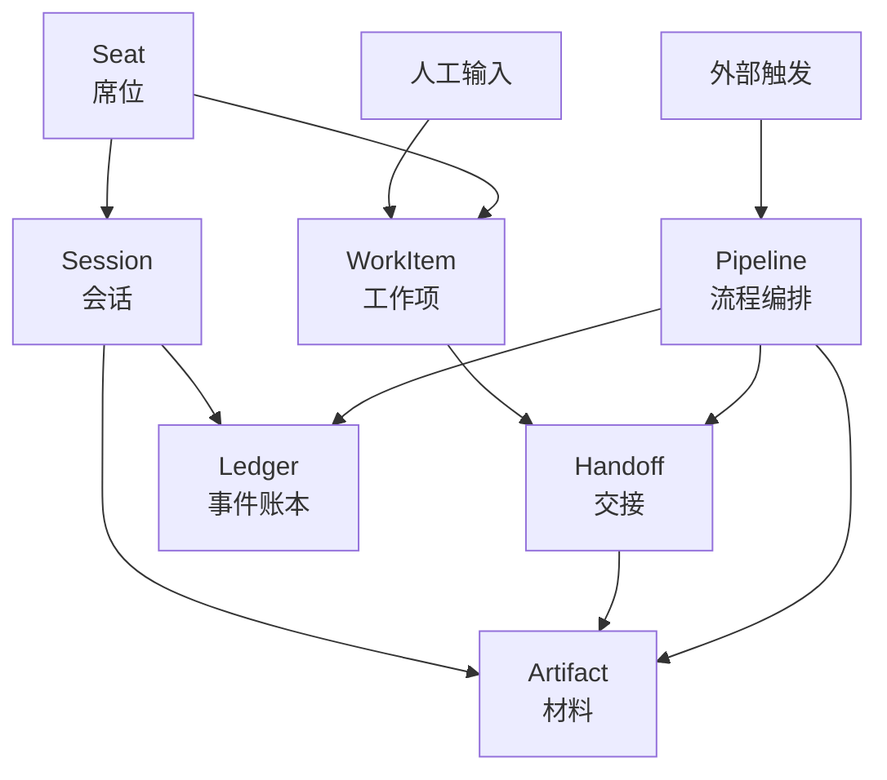
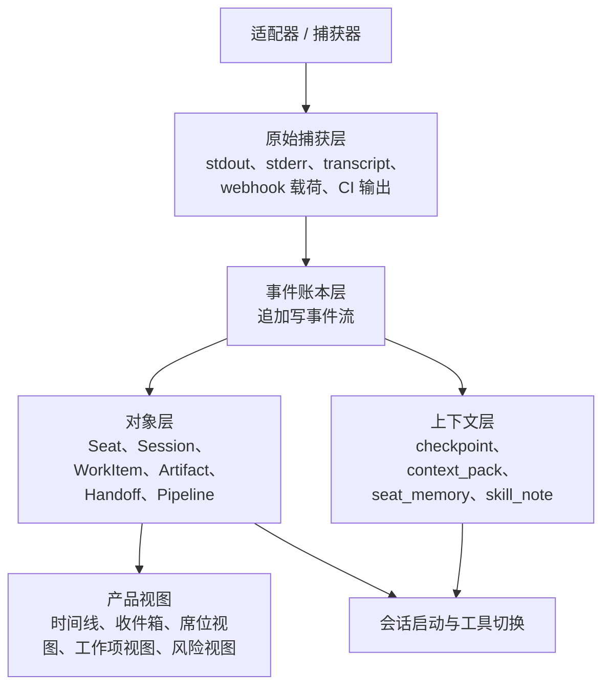
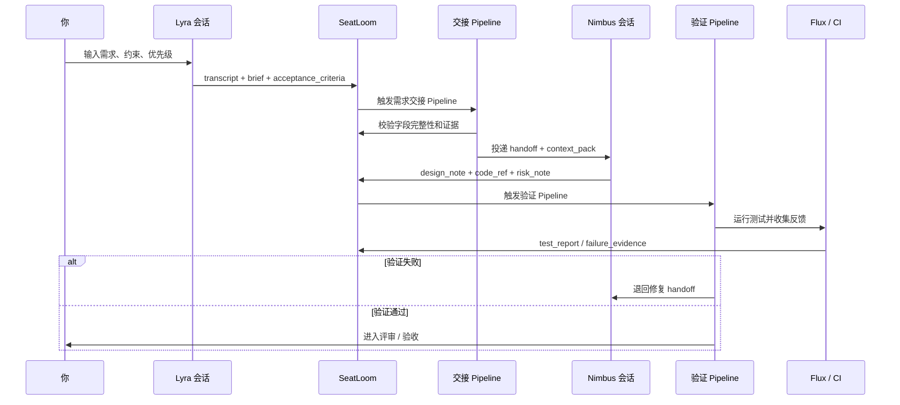
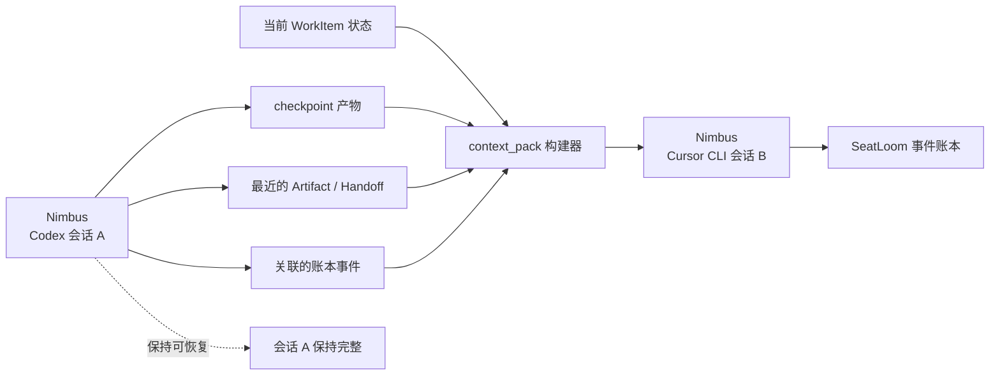
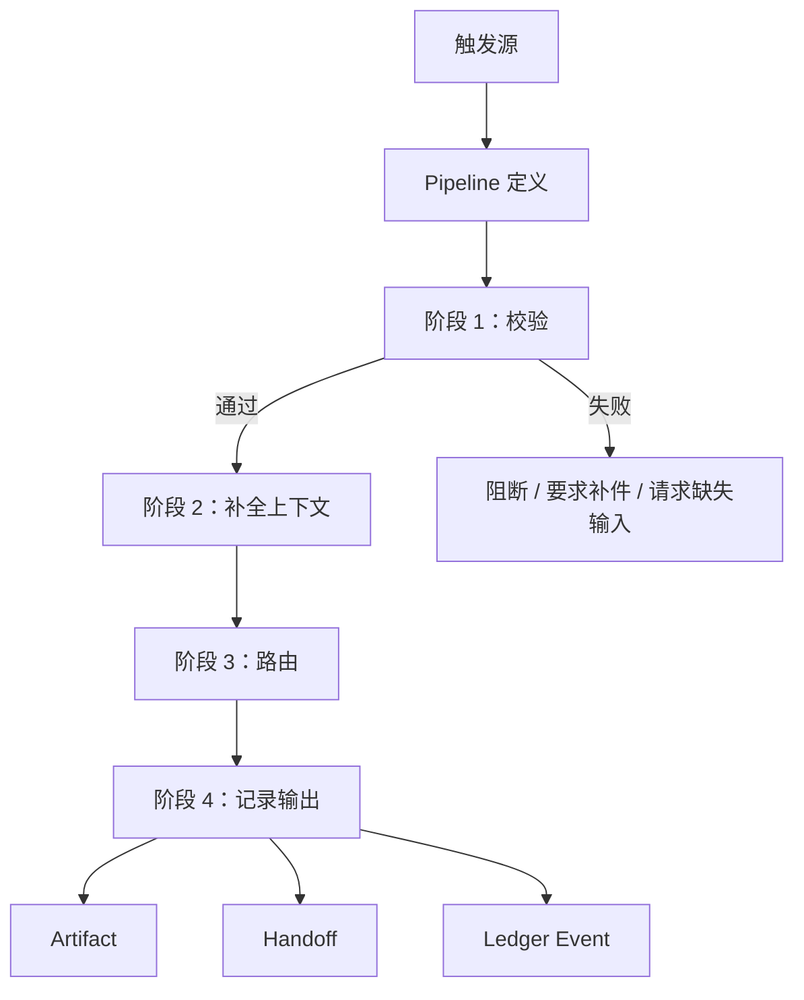
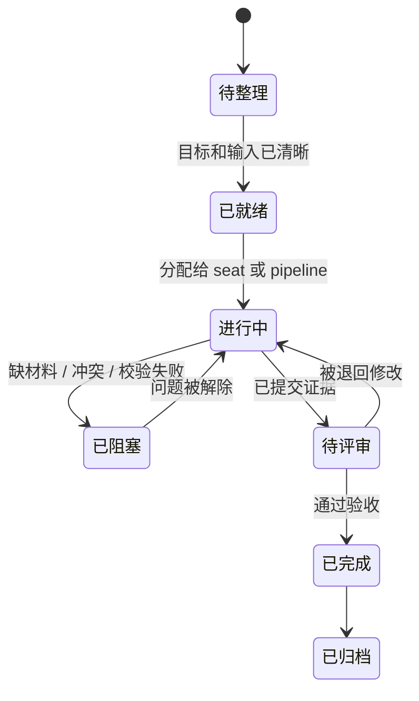
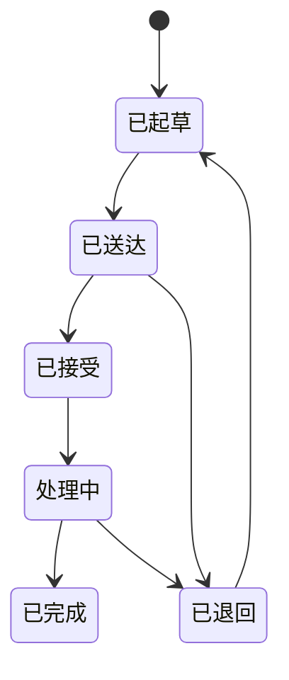

# SeatLoom PRD v0

| 项目 | 内容 |
| --- | --- |
| 状态 | **Archived — superseded by PRD v0.3** |
| 日期 | 2026-04-21 |
| 产品 | SeatLoom |
| 文档定位 | 产品与架构联合工作草案 |
| 目标读者 | 创始人、产品、架构、工程 |

## 1. 产品定义

SeatLoom 是一套面向 AI 编程团队的“本地优先”协作控制平面。

它不替代 Codex、Claude Code、Gemini CLI、GitHub Copilot、Cursor CLI 等底层 Agent 工具，而是覆盖在它们之上，把分散在多个终端窗口里的工作，组织成一个持续存在、可追踪、可协作、可积累的多席位团队。

其中：

- `Seat` 是稳定的协作身份，比如 Lyra、Nimbus、Flux，或者人类负责人。
- `Session` 是某个 Seat 在某个工具里的连续工作上下文，也就是“这个工具里的脑子”。
- `SeatLoom` 负责维护跨工具、跨阶段、跨人的项目级连续性，包括留痕、交接、自动化、记忆与技能沉淀。

SeatLoom 的核心承诺是：

1. 用显式 `Handoff` 和自动化流程，替代人工复制粘贴式编排。
2. 用项目级 Ledger 和对象模型，替代散落在各工具里的日志文件。
3. 保留工具原生 `Session` 的连续性，同时支持跨工具上下文重建。
4. 让 Seat、Pipeline、项目知识和工作经验可以随时间复利增长。

## 2. 问题陈述

今天，高阶用户已经可以通过打开多个终端窗口，让不同工具扮演不同角色，形成一个临时的 AI 小团队。这种方式能跑起来，但一旦项目变复杂，问题会迅速暴露。

核心痛点：

- 人本身变成了消息总线和调度器。
- 上下文分散在各工具日志、标准输出和隐式 session 记忆里。
- 当一个 Seat 需要从工具 A 切到工具 B 时，连续性很脆弱。
- 关键决策、证据、交接和失败原因很容易丢失。
- 团队没有统一的完成标准、质量关口和可审计机制。
- 自动化通常只是零散脚本，还没有成为协作系统的一等能力。

### 当前模式与目标模式

## 3. 产品目标

### 3.1 目标

- 让每个协作角色拥有稳定的 `Seat`，不再被具体工具绑定。
- 同时保住工具内连续上下文和项目级持久上下文。
- 对每个关键动作建立从输入、执行、输出到结果的完整可追踪链路。
- 把交接从零散聊天片段升级为显式、结构化的 `Handoff`。
- 把自动化与 `Pipeline` 建成一等公民，并要求完整留痕。
- 用工程约束而不是只靠 Prompt，来降低 LLM 的随意性。

### 3.2 v0 非目标

- 不替代各工具内部的原生记忆机制。
- 不做一个通用 IDE 或终端模拟器。
- 不在 v0 追求无人监管的全自动软件公司。
- 不要求所有工具在能力层面被完全拉齐，适配器深度可以不同。

## 4. 设计原则

- `本地优先`：项目数据默认随项目落地，可检查、可迁移、可回放。
- `工具无关`：SeatLoom 协调异构 Agent Runtime，而不是押注单一工具。
- `显式优于隐式`：能显式沉淀的上下文，不应只困在隐藏聊天历史里。
- `先追溯后优化`：先保证可追溯，再追求流程效率。
- `确定性自动化优先`：监听、校验、路由、关口尽量规则化和确定性。
- `高风险人工把关`：高风险状态变化必须有证据，必要时需要人工批准。

## 5. 参与者模型

SeatLoom 里的动作发起者，不只有人和 Seat。

| 参与者类型 | 含义 | 示例 |
| --- | --- | --- |
| `human` | 真实用户或评审者 | 你、协作者、审批人 |
| `seat` | 稳定协作身份 | Lyra、Nimbus、Flux |
| `automation` | 系统内自动化执行者 | handoff pipeline、verify pipeline、guard worker |
| `external` | SeatLoom 外部触发源 | GitHub、CI、文件系统、定时器、Webhook |

这样建模的意义在于：很多动作并不是某个 Seat 直接发起的，而是由自动化、外部事件或策略规则驱动。如果这些触发者不被显式建模，后续就无法真正审计“是谁、因为什么、在什么时候，推动了哪一步”。

## 6. 核心对象

SeatLoom 顶层对象应尽量保持少而稳。

| 对象 | 含义 | 存在价值 |
| --- | --- | --- |
| `Seat` | 稳定协作身份 | 保住角色连续性，不被工具切换打断 |
| `Session` | 某个工具内的连续工作上下文 | 保住 Codex、Claude Code、Cursor CLI 等工具内的脑状态 |
| `WorkItem` | 一件有目标、有边界、有完成标准的工作单元 | 把项目推进主线固定下来 |
| `Artifact` | 值得长期保存和复用的材料 | 避免顶层概念无限膨胀 |
| `Handoff` | 一次正式的交接动作 | 替代模糊的回复链和聊天片段 |
| `Pipeline` | 可复用的多阶段自动化定义 | 编排跨阶段、跨 Seat 的流程逻辑 |

### 6.1 重要的 `Artifact.kind`

为了控制复杂度，很多长期有价值的产出都收敛进 `Artifact`，通过 `kind` 区分。

- `brief`
- `acceptance_criteria`
- `decision`
- `design_note`
- `commit_ref`
- `diff_ref`
- `test_report`
- `checkpoint`
- `context_pack`
- `risk_note`
- `review_note`
- `incident_snapshot`

## 7. 系统模型

### 7.1 核心关系总览

### 7.2 存储与留痕分层

SeatLoom 需要把“捕获到了什么”和“如何理解、复用这些东西”分开处理。

### 7.3 每类内容存放在哪里

#### 原始捕获层

存放原始或轻度加工的来源材料：

- CLI `stdout` / `stderr`
- 命令历史
- 工具 transcript 片段
- webhook 载荷
- CI job 原始输出
- 文件变更快照

#### 事件账本层

存放标准化后的项目事件流水：

- 谁或什么触发了动作
- 影响了哪个对象
- 读取了哪些引用
- 生成了哪些引用
- 时间、状态、因果链、策略版本

#### 对象层

存放用户真正管理的稳定对象：

- `Seat`
- `Session`
- `WorkItem`
- `Artifact`
- `Handoff`
- `Pipeline`

#### 上下文层

存放为了让后续 Agent 工作更好而沉淀的上下文：

- session checkpoint
- 用于工具切换的 context_pack
- 工作摘要和长期记忆提炼
- 可复用 seat_memory
- 偏好、技能提示、经验片段

## 8. 关键流程

### 8.1 主协作流程

这是 SeatLoom 希望达成的典型工作方式。

### 8.2 跨工具连续性流程

这是 SeatLoom 成败的关键，因为同一个 Seat 很可能需要在不同工具之间切换。

关键原则：

- `Session` 负责保住一个工具里的脑子。
- `SeatLoom` 负责通过显式上下文材料，在工具之间重建可工作的脑子。
- SeatLoom 不假设底层工具的隐藏记忆可以被无损转移。

### 8.3 自动化与 `Pipeline` 流程

自动化不应只是“系统背后偷偷发生的事”，而应该是可见、可解释、可回放的一等能力。

典型触发源：

- human 输入
- seat 输出
- session 状态变化
- 新 commit
- PR 更新
- CI 结果
- 文件变化
- 定时器
- webhook

## 9. 状态模型

状态机的意义不是把系统做复杂，而是用工程规则减少歧义和 LLM 临场发挥。

### 9.1 `WorkItem` 生命周期

### 9.2 `Handoff` 生命周期

## 10. 产品视图

SeatLoom 应该让用户看到少数几个高价值视图，而不是逼用户去翻原始日志。

| 视图 | 它回答的问题 |
| --- | --- |
| 时间线视图 | 这个项目到底发生了什么，为什么发生？ |
| 席位视图 | 这个 Seat 现在在干什么，在哪些 Session 里？ |
| 工作项视图 | 这件事推进到了哪，卡在哪里？ |
| 交接收件箱 | 现在有哪些交接待接收、待处理、被退回？ |
| 会话视图 | 每个工具 Session 里保留了哪些连续上下文？ |
| 风险 / 异常视图 | 哪些 Pipeline 失败了、漂移了、缺证据？ |

这些视图不是独立的数据模型，而是同一套对象和 Ledger 的不同投影。

## 11. 功能需求

### 11.1 Seat 与 Session 连续性

- 系统必须允许用户在项目内定义持久 `Seat`。
- 系统必须支持一个 `Seat` 绑定多个跨工具 `Session`。
- 系统必须把工具原生 `Session` 当作一等对象，而不是压扁成一次泛化的执行记录。
- 系统必须支持基于 checkpoint 和 context pack 创建新 `Session`。

### 11.2 捕获与留痕

- 系统必须捕获原始工具输出，并保留来源引用。
- 系统必须为所有关键动作写入标准化 Ledger Event。
- 系统必须把 `Artifact`、`Handoff`、`Pipeline` 执行与源 `Session`、源事件关联起来。
- 系统必须为每个动作记录 actor 类型：`human`、`seat`、`automation`、`external`。

### 11.3 Artifact 与 Handoff

- 系统必须支持结构化 `Artifact` 创建和持久化。
- 系统必须允许 `Handoff` 关联多个 `Artifact`、目标对象、交接目的和期望结果。
- 系统必须支持 `Handoff` 的接收、退回、完成流程。
- 系统必须在关键状态变更前校验 `Handoff` 必填字段。

### 11.4 Pipeline 自动化

- 系统必须支持基于 trigger 的 `Pipeline`。
- 系统必须记录 Pipeline 为什么启动、读取了哪些输入、执行了哪些阶段、产出了什么输出。
- 系统必须支持在推进流程前做确定性关口判断。
- 系统必须支持受限的 LLM 辅助阶段，用于摘要、分类、context_pack 组装等工作。

### 11.5 工程护栏

- 系统必须阻止静默状态改写。
- 系统必须要求关键状态变化附带证据。
- 系统必须支持 `policy_version`，保证后续可以解释“为什么当时这样判定”。
- 系统必须区分确定性自动化动作与模型生成建议。

## 12. v0 范围建议

第一版应聚焦在“协作骨架”，而不是一开始就做齐所有高级能力。

### 12.1 纳入范围

- 支持项目内定义命名 `Seat`
- 支持以下工具族的 `Session` 注册与关联：
  - Codex
  - Claude Code
  - Gemini CLI
  - GitHub Copilot
  - Cursor CLI
- 支持 session 输出和关键外部事件的原始捕获与事件账本
- 把 `WorkItem`、`Artifact`、`Handoff`、`Pipeline` 作为核心产品对象
- 支持为跨工具切换生成 `context_pack`
- 提供时间线、交接收件箱、工作项视图、席位视图
- 至少内置两个 Pipeline：
  - `requirement_handoff`
  - `verify_and_return`

### 12.2 暂不纳入 v0

- 无人监管的全自动规划与交付
- 所有支持工具的深度适配能力完全拉齐
- 复杂的组织级权限与身份系统
- Marketplace 级技能生态
- 能自动重写 Seat 行为的长周期自优化闭环

## 13. 端到端示例场景

下面这个场景，就是 SeatLoom 希望支撑的一个小型四席位项目团队。

1. 你创建一个新的 `WorkItem`，描述需求或缺陷。
2. Lyra 在 Claude Code 的 `Session` 中接收输入，产出 `brief` 和 `acceptance_criteria`。
3. SeatLoom 记录原始 transcript，把可长期复用的部分提升为 `Artifact`，并触发需求交接 Pipeline。
4. Nimbus 在 Codex 的 `Session` 中收到结构化 `Handoff`，读取相关 `Artifact` 后开始设计和实现。
5. Nimbus 发现下一阶段更适合用 Cursor CLI，于是切换工具。
6. SeatLoom 从 checkpoint、最近 Artifact、WorkItem 状态和 Handoff 历史中组装 `context_pack`，启动新的 `Session`。
7. 实现完成后，系统触发验证 Pipeline。
8. Flux 或 CI 返回测试报告；如果失败，SeatLoom 自动创建一个修复 `Handoff` 回给 Nimbus。
9. 如果验证通过，时间线与工作项视图显示该任务已进入待评审状态，等待你确认。
10. 整个链路里，每一步都能回溯到输入、Session、Artifact、Handoff、Pipeline 和结果。

## 14. 成功指标

### 14.1 用户价值指标

- 单个 `WorkItem` 上人工跨窗口复制粘贴的耗时
- Seat 从一个工具迁移到另一个工具所需时间
- 具备完整追踪链路的 WorkItem 占比
- 从实现完成到拿到验证结果的耗时
- 因缺少上下文而被退回的 Handoff 比例

### 14.2 系统质量指标

- 原始捕获完整率
- `context_pack` 可用率
- Pipeline 失败率
- 有证据支撑的状态变更占比
- Session 恢复成功率

## 15. 风险与待定问题

- 每个工具内部的隐藏上下文，可能永远无法被完整导出。
- 某些工具可能更容易拿到日志，但不容易拿到 session 控制能力。
- 如果 Handoff 结构过重，用户可能觉得操作成本太高。
- `Artifact` 提升策略需要拿捏，提太多会很吵，提太少会丢价值。
- v0 是否需要把技能成长做成显式产品对象，还是先只做被动记忆沉淀，还需要判断。
- Pipeline 的执行细节究竟展示多少给用户，多少留在系统内部，仍需收敛。

## 16. 下一轮讨论建议

这份 PRD 的作用是固定讨论底盘，不是冻结设计。下一轮最值得细化的话题是：

1. 明确 `Seat`、`Session`、`WorkItem`、`Artifact`、`Handoff`、`Pipeline` 的最小 schema。
2. 明确哪些存储层适合用本地文件，哪些适合用嵌入式数据库。
3. 把前两个 Pipeline 的定义写细：触发条件、输入、关口、输出、失败回退。
4. 明确一个 `context_pack` 至少必须包含哪些内容，才能可靠支撑跨工具切换。
5. 明确哪些视图必须进入 v0，哪些能力先只保留为内部实现。
